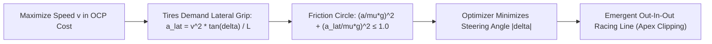

# Mathematical Modeling and Optimal Control Problem (OCP) Formulation

This document details the theoretical derivation of the Autonomous Racing Non-Linear Model Predictive Controller (MPCC) implemented in FastLap NMPC. The controller optimizes trajectory and vehicle performance simultaneously to minimize lap time while guaranteeing absolute track boundary safety in the PACSim simulation environment.

---

## 1. Curvilinear Frenet-Serret Coordinate Frame

Standard vehicle models parameterized in global Cartesian coordinates $(X, Y, \Psi)$ require non-convex polygon representations of track boundaries that are computationally intractable at 100 Hz. By reformulating kinematics along a reference curve in curvilinear Frenet coordinates, track boundaries translate directly into linear state box bounds:

$$
\mathbf{x} = \begin{bmatrix} s \\ e_y \\ e_\psi \\ v \\ \delta \end{bmatrix}
$$

where:
- $s \in [0, L_{\text{track}}]$: Curvilinear arc length along the reference centerline [m].
- $e_y$: Lateral deviation of the vehicle center of gravity (CG) from the reference curve [m] (positive to the left, negative to the right).
- $e_\psi = \psi - \psi_{\text{ref}}(s)$: Heading error relative to the tangent of the reference path at arc length $s$ [rad].
- $v$: Longitudinal velocity along the vehicle body x-axis [m/s].
- $\delta$: Wheel steering angle [rad].

```
                  Reference Path (Tangent T)
                          ^
                         /
                        /
                       /  psi_ref(s)
                      +--------------------> Global X
                     /
                    /
                   /   e_y (normal offset)
      Vehicle CG  * <---------------------+ Reference Point at arc length s
                  | \
                  |  \  psi (Vehicle Heading)
                  |   \
                  v    \
```

---

## 2. Kinematic Single-Track (Bicycle) Model

For control frequencies at 100 Hz and speeds up to $\approx 25\text{ m/s}$ (90 km/h), the kinematic single-track model accurately captures cornering geometry while maintaining real-time QP solvability.

### 2.1 Side-Slip Angle at Vehicle CG

The kinematic side-slip angle $\beta$ at the vehicle center of gravity is computed from the front and rear axle distances ($l_f, l_r$) and the wheelbase $L = l_f + l_r$:

$$
\beta(\delta) = \arctan\left(\frac{l_r}{L} \tan \delta\right)
$$

In PACSim, vehicle parameters from `vehicleModel.yaml` are:
- $l_f = 0.69\text{ m}$
- $l_r = 0.84\text{ m}$
- $L = 1.53\text{ m}$
- $g = 9.81\text{ m/s}^2$

### 2.2 Global Yaw Rate

The global yaw rate of the vehicle chassis is:

$$
\dot{\psi}_{\text{veh}} = \frac{v \cos \beta(\delta)}{L} \tan \delta
$$

### 2.3 Curvilinear State Derivatives

Taking time derivatives with respect to the moving Frenet-Serret frame:

1. **Progress along centerline ($\dot{s}$)**:

   $$
   \dot{s} = \frac{v \cos(e_\psi + \beta)}{1 - e_y \kappa(s)}
   $$

   *Singularity Protection*: To guarantee numerical stability in acados if $e_y \to 1/\kappa$, the denominator is lower-bounded:

   $$
   \operatorname{denom} = \max\left(0.05,\, 1 - e_y \kappa(s)\right)
   $$

2. **Lateral error evolution ($\dot{e}_y$)**:

   $$
   \dot{e}_y = v \sin(e_\psi + \beta)
   $$

3. **Heading error rate ($\dot{e}_\psi$)**:

   $$
   \dot{e}_\psi = \dot{\psi}_{\text{veh}} - \kappa(s) \dot{s} = \frac{v \cos \beta}{L} \tan \delta - \kappa(s) \frac{v \cos(e_\psi + \beta)}{\operatorname{denom}}
   $$

4. **Longitudinal velocity ($\dot{v}$)**:

   $$
   \dot{v} = a
   $$

   where $a$ is the commanded longitudinal acceleration [m/s²].

5. **Wheel steering angle ($\dot{\delta}$)**:

   $$
   \dot{\delta} = v_\delta
   $$

   where $v_\delta$ is the commanded steering angular velocity [rad/s].

The explicit ordinary differential equation (ODE) vector field is:

$$
\dot{\mathbf{x}} = \mathbf{f}_{\text{expl}}(\mathbf{x}, \mathbf{u}, \mathbf{p}) = \begin{bmatrix}
\frac{v \cos(e_\psi + \beta)}{\max(0.05, 1 - e_y \kappa)} \\
v \sin(e_\psi + \beta) \\
\frac{v \cos\beta}{L} \tan\delta - \kappa \dot{s} \\
a \\
v_\delta
\end{bmatrix}
$$

with control inputs $\mathbf{u} = [a, v_\delta]^T$ and runtime parameters $\mathbf{p} = [\kappa, w_l, w_r, \mu]^T$.

---

## 3. Autonomous Racing Line Emergence (MPCC Principle)

In standard tracking controllers, $e_y = 0$ is penalized heavily, forcing the vehicle to remain on the geometric centerline. In **FastLap NMPC**, the racing line emerges autonomously through the physical interaction between **speed maximization** and the **non-linear friction circle**:



### Mathematical Proof of Emergent Apex Cutting:
1. To maximize vehicle progress, the optimizer aims to keep $v_k$ as high as possible.
2. At higher speeds, lateral acceleration $a_{\text{lat}} \approx \frac{v^2}{L} \tan\delta$ increases quadratically.
3. The tire grip constraint imposes:

   $$
   \left(\frac{a}{\mu g}\right)^2 + \left(\frac{v^2 \tan\delta}{L \mu g}\right)^2 \le 1.0
   $$

4. Therefore, to sustain a higher speed $v$ through a corner of curvature $\kappa > 0$, the optimizer **must minimize the steering angle $|\delta|$**.
5. From the heading error dynamics:

   $$
   \dot{e}_\psi = \frac{v \cos\beta}{L} \tan\delta - \kappa(s) \dot{s}
   $$

   The only kinematic trajectory that minimizes $|\delta|$ over a curve within the lateral corridor $[-w_r + \text{margin}, w_l - \text{margin}]$ is:
   - **Entry**: Swing to the outside ($e_y < 0$ for a left curve).
   - **Apex**: Cut to the inside boundary ($e_y > 0$).
   - **Exit**: Run wide to the outside ($e_y < 0$).
6. By setting a very low centering penalty ($q_{ey} = 0.08$), the optimizer is given full freedom to utilize the entire width of the corridor, clipping apexes naturally and cutting lap times.

---

## 4. Non-Linear Friction Circle Constraint & Kamm Circle Capping

### 4.1 OCP Non-Linear Friction Circle Constraint
Combined tire forces are bounded by available tire-road friction $\mu$:

$$
\left(\frac{a}{\mu g}\right)^2 + \left(\frac{a_{\text{lat}}}{\mu g}\right)^2 \le 1.0 + s_{\text{friction}}
$$

where $s_{\text{friction}} \ge 0$ is a soft slack variable penalized quadratically ($Z_l = 3000.0, Z_u = 3000.0$) in the OCP cost to guarantee QP feasibility during sharp corner entry transitions.

### 4.2 Runtime Kamm Circle Grip Capping
In the ROS 2 node, before sending control bounds to the acados solver, dynamic grip capping protects against sudden snap oversteer during high-g corner exits:

$$
a_{\text{lat}} \approx \frac{v^2}{L} \tan|\delta|
$$

$$
a_{\text{lon,kamm}} = \sqrt{\max\left(0.4,\, (\mu g \cdot 0.92)^2 - a_{\text{lat}}^2\right)}
$$

$$
a_{\text{eff,max}} = \min\left(a_{\text{eff,max}},\, a_{\text{lon,kamm}}\right)
$$

When cornering hard at 1.8 g, longitudinal acceleration is dynamically capped, preventing tire breakaway. As the vehicle straightens on exit, full motor acceleration (4.8 m/s²) is unlocked.

---

## 5. Optimal Control Problem (OCP) Formulation

The discrete-time optimal control problem over a prediction horizon of $N = 30$ stages with sampling time $\Delta t = 0.05\text{ s}$ ($T_f = 1.5\text{ s}$) is formulated as:

$$
\min_{\mathbf{x}_{0:N}, \mathbf{u}_{0:N-1}, \mathbf{s}_{0:N-1}} \sum_{k=0}^{N-1} \left( \frac{1}{2} \|\mathbf{y}_k - \mathbf{y}_{\text{ref},k}\|_{\mathbf{W}}^2 + z_l^T s_{l,k} + z_u^T s_{u,k} + \frac{1}{2} s_{l,k}^T Z_l s_{l,k} + \frac{1}{2} s_{u,k}^T Z_u s_{u,k} \right) + \frac{1}{2} \|\mathbf{y}_N - \mathbf{y}_{\text{ref},N}\|_{\mathbf{W}_e}^2
$$

### 5.1 Residual Vectors
- **Stage Residual**:

  $$
  \mathbf{y}_k = [v_k,\, e_{y,k},\, e_{\psi,k},\, \delta_k,\, a_k,\, v_{\delta,k}]^T
  $$

  $$
  \mathbf{y}_{\text{ref},k} = [v_{\text{target},k},\, 0,\, 0,\, 0,\, 0,\, 0]^T
  $$

- **Terminal Residual**:

  $$
  \mathbf{y}_N = [v_N,\, e_{y,N},\, e_{\psi,N},\, \delta_N]^T
  $$

  $$
  \mathbf{y}_{\text{ref},N} = [v_{\text{target},N},\, 0,\, 0,\, 0]^T
  $$

### 5.2 Proven Racing Weighting Matrices
The weighting matrices are tuned for autonomous contouring optimization:

$$
\mathbf{W} = \operatorname{diag}\begin{bmatrix}
w_v & = & 4.00 & \text{(High-speed progress tracking)} \\
q_{e_y} & = & 0.08 & \text{(Mild centering regularizer: unlocks apex cutting)} \\
q_{e_\psi} & = & 0.85 & \text{(Optimal slip angle alignment with exit stability)} \\
r_\delta & = & 0.35 & \text{(Steering centering regularization)} \\
r_a & = & 0.30 & \text{(Longitudinal drive/brake smoothness)} \\
r_{v_\delta} & = & 3.60 & \text{(Steering rate damping: eliminates chatter)}
\end{bmatrix}
$$

Terminal weights are scaled by $1.5\times$ ($\mathbf{W}_e = \operatorname{diag}[6.0, 0.12, 1.28, 0.35]$).

### 5.3 Stage-Dependent Box Constraints

| Variable | Lower Bound (Stage $k$) | Upper Bound (Stage $k$) | Enforcement |
| :--- | :--- | :--- | :--- |
| **$e_y$** | $-w_{r,k} + \text{margin}$ | $w_{l,k} - \text{margin}$ | Soft state bound ($Z_l = 3000$) |
| **$v$** | $0.0\text{ m/s}$ | $\max(35.0, 1.3 \cdot v_{\text{straight}})\text{ m/s}$ | Hard state box constraint |
| **$\delta$** | $-0.52\text{ rad}$ ($-30^\circ$) | $0.52\text{ rad}$ ($+30^\circ$) | Hard mechanical steering limit |
| **$a$** | $-8.0\text{ m/s}^2$ | $a_{\text{eff,max}}$ ($4.8\text{ m/s}^2$ on straights) | Control box constraint |
| **$v_\delta$** | $-1.5\text{ rad/s}$ | $1.5\text{ rad/s}$ | Control box constraint |

---

## 6. Real-Time Iteration (SQP-RTI) Scheme

To execute within the strict $10.0\text{ ms}$ control budget of ROS 2 at 100 Hz, the problem is solved using the **acados SQP-RTI** algorithm:

1. **Preparation Phase (inter-sample)**:
   - Integrates dynamics using 4th-order explicit Runge-Kutta (ERK4).
   - Linearizes constraints around the previous solution trajectory.
   - Condenses the horizon using Partial Condensing ($N_{\text{cond}} = 5$).
2. **Feedback Phase (immediate on state arrival)**:
   - Injects the measured initial state $\mathbf{x}_0 = [0.0, e_y, e_\psi, v, \delta]^T$.
   - Executes a single QP solve using **HPIPM** vectorized with **BLASFEO**.
   - Extracts optimal control $\mathbf{u}_0^* = [a_0^*, v_{\delta,0}^*]^T$ and streams to PACSim in $< 1.5\text{ ms}$.
